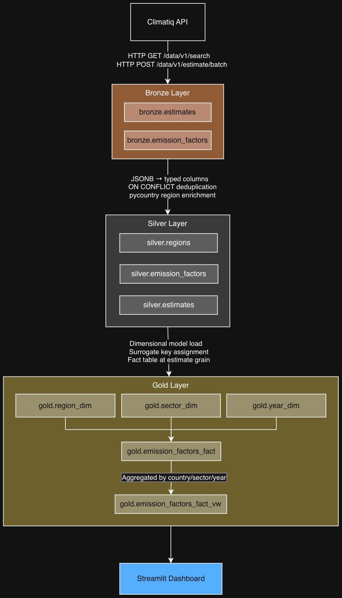

# Climatiq Medallion ETL Pipeline

A production-style data engineering pipeline implementing the **Bronze → Silver → Gold** medallion architecture, ingesting carbon emission factor data from the [Climatiq API](https://www.climatiq.io/) into PostgreSQL with a live Streamlit dashboard.

## Architecture Diagram



## Tech Stack

- **Python 3.12** — extraction, transformation, loading, dashboard
- **PostgreSQL 18** (Postgres.app) — data warehouse
- **Streamlit** — interactive dashboard
- **pandas** — dataframe handling in dashboard
- **pycountry** — ISO alpha-2 region code enrichment
- **Climatiq API** — carbon emission factor data source

## Project Structure

```
src/
├── extraction.py       # Bronze: fetch from Climatiq API
├── transformation.py   # Silver: extract JSONB into typed columns, enrich regions
├── loading.py          # Bronze: insert raw data into PostgreSQL
├── gold.py             # Gold: populate dimensional model and fact table
├── dashboard.py        # Streamlit dashboard reading from gold.emission_factors_fact_vw
└── db.py               # Shared database connection
sql/
├── 001_create_database.sql
├── 002_bronze_schema.sql
├── 003_silver_schema.sql
├── 004_gold_schema.sql
├── 005_reporting_views.sql
├── 999_reset_bronze.sql
├── 999_reset_silver.sql
└── 999_reset_gold.sql
docs/
└── Climatiq.postman_collection.json
```

## Setup

**Prerequisites:** Python 3.12, Postgres.app running locally, Climatiq API key

```bash
# Install dependencies
make install

# Create database and Bronze schema
make db-setup

# Create Silver schema
make db-reset-s

# Create Gold schema and reporting view
make db-reset-g
```

Create a `.env` file in the project root:
```
CLIMATIQ_API_KEY=your_key_here
DB_HOST=localhost
DB_PORT=5432
DB_NAME=climatiq_pipeline
DB_USER=your_os_username
DB_PASS=
```

## Running the Pipeline

```bash
# Bronze: fetch from Climatiq API and load raw JSONB into PostgreSQL
make extract

# Silver: promote JSONB to typed columns, deduplicate, enrich regions
make transform

# Gold: populate dimensional model and fact table
make gold

# Dashboard: launch Streamlit app
make dashboard
```

## Data Quality Notes

- **Bronze** is a truncate-reload layer — raw data is replaced on each run, preserving source fidelity in JSONB
- **Silver** deduplicates on `emission_factor.id` — records without a valid ID or with duplicate IDs are excluded via `ON CONFLICT (id) DO NOTHING`
- In testing, 100 Bronze estimate records reduced to 98 in Silver due to 3 records sharing the same `emission_factor.id` (API duplicate) and 2 records with null IDs
- **Region enrichment** uses `pycountry` to map ISO alpha-2 codes to full country names. Sub-national codes (e.g. `CA-BC`) fall back to the parent country (`Canada`). Climatiq-specific regional aggregations (`ROW_WF`, `ROW_WE`, `ROW_WM`) represent "Rest of World" groupings with no ISO equivalent and are stored as `"Unknown"`
- **Gold fact table** is at individual estimate grain — one row per estimate. Aggregations (`avg_co2e`, `min_co2e`, `max_co2e`, `avg_factor`) are computed in `gold.emission_factors_vw` and consumed by the dashboard
- **Implied emission factor** (`avg_factor`) is back-calculated as `co2e / activity_value` since the Climatiq search endpoint does not expose raw factor coefficients

## PostgreSQL Schema

Each medallion layer lives in its own schema:

| Schema | Table / View | Description |
|--------|-------------|-------------|
| `bronze` | `emission_factors` | Raw emission factor JSON from `/data/v1/search` |
| `bronze` | `estimates` | Raw CO2e estimate JSON from `/data/v1/estimate/batch` |
| `silver` | `regions` | Distinct region codes enriched with full country names |
| `silver` | `emission_factors` | Typed, deduplicated emission factors |
| `silver` | `estimates` | Typed, deduplicated CO2e estimates |
| `gold` | `region_dim` | Region dimension with country name and source lineage |
| `gold` | `sector_dim` | Sector dimension with source lineage |
| `gold` | `year_dim` | Year dimension with source lineage |
| `gold` | `emission_factors_fact` | Fact table — one row per estimate |
| `gold` | `emission_factors_fact_vw` | Reporting view — aggregated by country, sector, year |
